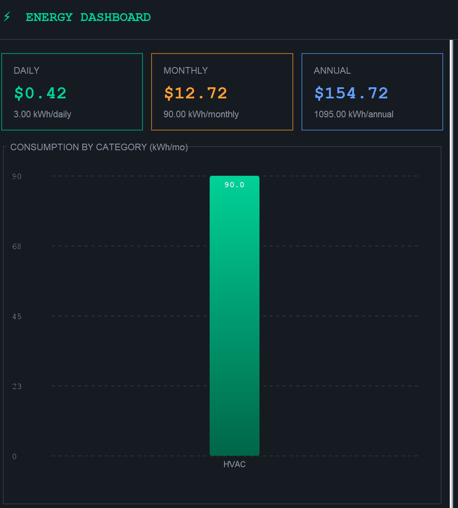

# WattWise

## Description

WattWise is a Java desktop application that helps households understand and manage their electricity usage. Users enter their location and appliances, and WattWise automatically pulls the latest residential electricity rate for their state from the U.S. Energy Information Administration (EIA) API — no manual rate lookup required. It then calculates daily, monthly, and annual energy consumption and costs, displayed in a real-time dark-themed dashboard with a category breakdown chart.

## Table of Contents

- [Description](#description)
- [Installation](#installation)
- [Usage](#usage)
- [Credits](#credits)
- [License](#license)
- [Badges](#badges)
- [Features](#features)
- [How to Contribute](#how-to-contribute)
- [Tests](#tests)

## Installation

1. Download and install the [Java Development Kit (JDK) 11 or higher](https://adoptium.net).

2. Clone this repository:
```bash
   git clone https://github.com/your-username/WattWise.git
   cd WattWise
```

3. Create a `config.properties` file in the project root using the provided example:
```bash
   cp config.properties.example config.properties
```

4. Add your [EIA API key](https://www.eia.gov/opendata/) to `config.properties`:
```
   EIA_API_KEY=your_key_here
```

5. Compile the project:
```bash
   javac Main.java User.java Appliance.java GUI.java EIAClient.java
```

## Usage

Run the program from your project directory:
```bash
java Main
```

The CLI will walk you through setup — name, city, and state. WattWise fetches your state's current electricity rate automatically, then launches the dashboard where you can add, remove, and analyze appliances in real time.

**Adding appliances:** Type a common appliance name (e.g. "AC", "fridge", "laptop") and WattWise will suggest the wattage and typical daily usage — just press Enter to accept or type your own value.



## Credits

https://github.com/HassanZafar-2021

## License

This project is currently unlicensed.

## Badges


## Features

- **Automatic Rate Lookup** — fetches your state's latest residential electricity rate from the EIA API; falls back to manual entry if unavailable
- **Smart Appliance Suggestions** — recognizes 50+ common appliances by name and pre-fills wattage and usage hours
- **Live Dashboard** — dark-themed Swing GUI with daily, monthly, and annual cost cards that update instantly as you add or remove appliances
- **Category Breakdown Chart** — bar chart showing kWh consumption by category (Kitchen, HVAC, Entertainment, etc.)
- **16 Preset Appliances** — add common appliances in one click from the GUI
- **Export Report** — generates a formatted text summary of all appliances and costs

## How to Contribute

1. Fork this repository
2. Clone the fork to your local machine
3. Create a new branch for your feature or fix:
```bash
   git checkout -b feature/your-feature-name
```
4. Commit your changes and push to your branch
5. Open a pull request with a clear description of your changes

## Tests

No automated tests at this time.